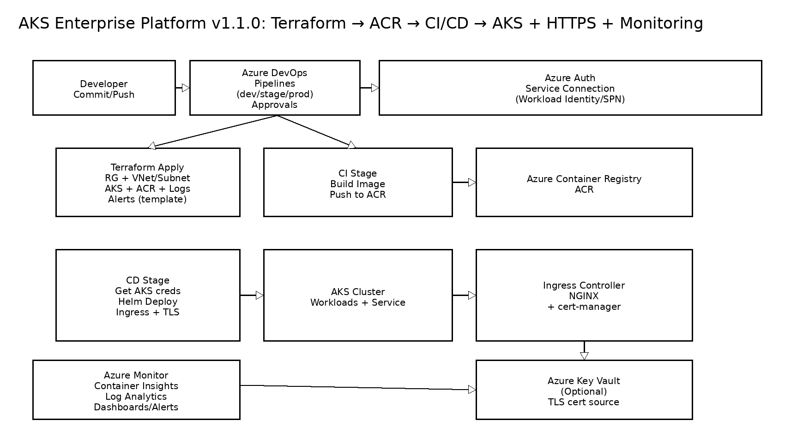

# Azure AKS Enterprise Platform (Terraform + Azure DevOps + ACR + Helm)

**Version:** v1.1.0 (Generated 2026-02-14)

This project demonstrates a production-style Azure DevOps workflow to provision and deploy an application on **AKS**:

- **Terraform** provisions: Resource Group, VNet/Subnet, **AKS**, **ACR**, Log Analytics
- **Azure DevOps Pipelines** builds a container image and pushes to **ACR**
- **Helm** deploys the application to **AKS** in a CD stage

---

## Architecture


### Flow
1. Commit → Azure Repos / GitHub
2. Pipeline CI builds Docker image and pushes to ACR (tag = BuildId)
3. Pipeline CD authenticates to Azure, gets AKS credentials, and runs `helm upgrade --install`
4. App runs on AKS behind a Kubernetes Service (optional Ingress)

---

## Repo Structure
```text
azure-aks-enterprise-platform/
├── app/                      # sample app (FastAPI)
├── Dockerfile
├── helm/demo-api/            # Helm chart
├── terraform/                # Azure IaC (AKS + ACR)
├── pipelines/azure-pipelines.yml
└── docs/architecture.png
```

---

## Prerequisites
- Terraform >= 1.6
- Azure CLI
- kubectl + Helm
- Azure subscription + Azure DevOps project

Login:
```bash
az login
az account show
```

---

## Step 1 — Provision AKS + ACR (Terraform)

### 1.1 (Optional) Configure remote state backend
Copy and edit:
```bash
cp terraform/backend.tf.example terraform/backend.tf
```
Fill storage account backend details (recommended for teams).

### 1.2 Configure variables
```bash
cd terraform
cp terraform.tfvars.example terraform.tfvars
# edit terraform.tfvars
```

### 1.3 Deploy
```bash
terraform init
terraform apply -auto-approve
```

### 1.4 Connect to cluster
```bash
az aks get-credentials -g <resource_group_name> -n <aks_cluster_name> --overwrite-existing
kubectl get nodes
```

---

## Step 2 — Azure DevOps Setup

### 2.1 Create Service Connection
Azure DevOps → Project Settings → Service connections → New:
- **Azure Resource Manager**
- Prefer **Workload Identity Federation** (best practice)

You’ll reference it as:
- `AZURE_SUBSCRIPTION` (pipeline variable)

### 2.2 Create ACR service connection (for Docker@2 task)
Option A (recommended): create a **Docker registry service connection** pointing to ACR.
- Name it the same as `ACR_NAME` or set `ACR_SERVICE_CONNECTION` variable.

### 2.3 Pipeline variables
Set these pipeline variables (or a variable group):
- `AZURE_SUBSCRIPTION` = Azure RM service connection name
- `ACR_NAME` = your ACR name (no `.azurecr.io`)
- `AKS_RG` = resource group
- `AKS_NAME` = AKS cluster name
- `K8S_NAMESPACE` = `demo`
- (Optional) `ACR_SERVICE_CONNECTION` = Docker registry service connection name

---

## Step 3 — Run the pipeline
- CI stage: build and push image to ACR
- CD stage: deploy to AKS using Helm

---

## Verify
```bash
kubectl -n demo get deploy,svc
kubectl -n demo port-forward svc/demo-api 8080:80
curl http://localhost:8080/health
```
Expected:
```json
{"status":"ok"}
```

---

---

## HTTPS (Ingress + cert-manager + Key Vault)

This repo includes a complete guide for enabling HTTPS on AKS using:
- NGINX Ingress Controller
- cert-manager
- Optional Key Vault integration

See:
- `docs/ingress-tls-keyvault.md`
- `k8s/cert-manager/`
- `k8s/keyvault/`

To enable TLS with Let's Encrypt (quick demo):
```bash
kubectl apply -f k8s/cert-manager/clusterissuer-letsencrypt-staging.yaml

helm upgrade --install demo-api ./helm/demo-api -n demo --create-namespace \
  --set ingress.enabled=true \
  --set ingress.hostname=demo.example.com \
  --set ingress.tls.enabled=true \
  --set ingress.tls.secretName=demo-api-tls \
  --set ingress.tls.clusterIssuer=letsencrypt-staging
```

---

## Monitoring & Alerts (Azure Monitor)

AKS monitoring is enabled via Log Analytics Workspace in Terraform.
See:
- `docs/monitoring-azure-monitor.md`

---

## Multi-environment deployments (dev / staging / prod)

The pipeline supports deploying to **dev**, **staging**, or **prod** via a parameter.
Create Azure DevOps **Environments** named `dev`, `staging`, `prod` and configure:
- Approvals & Checks for `staging` and `prod` (recommended)

Pipeline file:
- `pipelines/azure-pipelines.yml`


## Cleanup
```bash
cd terraform
terraform destroy -auto-approve
```
